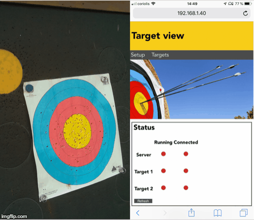

# Archery-Target-processing
Image processing of an archery target using a Raspberry Pi, HTML5-CSS-Javascript and Python for server side.
The app uses computer computer vision to identify the point of impact of each arrow, which is send onto a web server allowing the archer to see the point of impact of is arrows in real time.

## Hardware
The project uses:
- a Raspberry Pi B with a camera module
- a HC-SR04 ultrasonic distance sensor
- several diodes and resistances
- a computer
- (a tripod)

## Operation of the app
The Raspberry Pi has 3 roles: it take and sends the pictures through a socket pipe to the main computer which host the server, it process the distance sensor data and trigger the calibration process through the socket pipe if necessary, and it operate some LEDs to show the user what is going on.

The computer recieve the images and callibration orders via the RPI. It then uses a Python script to process each images. The informations found are send to a web server which allow the user to see the information on a local website. 

### Raspberry Pi
When boot up, the RPi start the script. If the socket server is running on the computer, it will connect to it and start sending data. if it's not, the RPi will try to connect continuously.
When connected to the server, if the distance sensor detects a distance inferior to a certain threshold, (meaning the archer is at the target to take out his arrows), the RPi will start a loop. While there is movement near the sensor, the loop waits. Then, if there is no movement for 10 seconds, the RPi sends a callibration order to the computer, which will operate the designated function.

### Image processing
    

In order to evaluate the point of impact of each arrow precisely, many image processing operations are done. The main steps are: the evaluation of every line on the image, masking of the unwanted ones, extracting the point of impact, searching for the target zones and calculating the coordinates of the impact on a plane surface.
Each step is constituted of many operation such as filters, masks or mathematics transforms. The coordinates of an impact are returned as polar coordinates, caracterized by an angle, and the distance ratio, allowing the front end part to use whatever size of target representation.

### Networking
To communicate with the RPi, the computer hosts a socket server. It can connect to multiple RPi at the same time, allowing for a further developpement of the project. The server recieves pictures and calibration order from each RPi.

### Front end 
The front end of the app is powered by an HTTP web server programmed in python. The local website is constituted of an home page which features a table displaying in real time the state of each of the composants of the project, an hub page where the client can chose between the differents RPi connected, and each individual target pages. The target pages displays a representation of a target and places the impacts over it. It also features a score board. The value of each arrows is calculated server side.
The communication between the server en client side is made using GET requests of specified Json file which contains for exemple the state of each elements or the coordinates of each impacts and score of each arrows.
